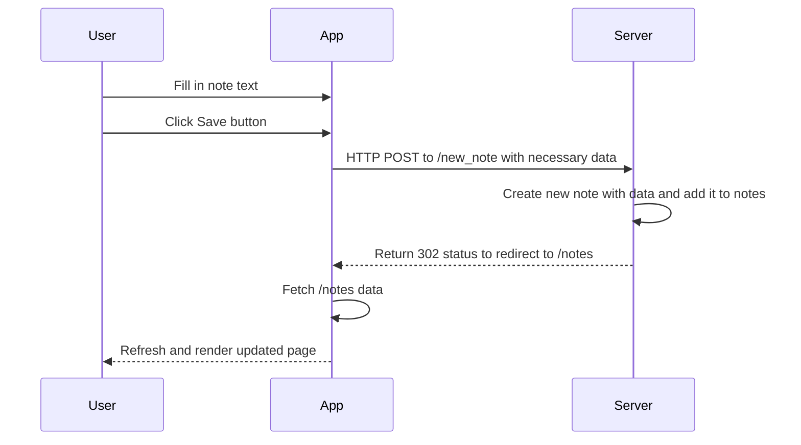

```mermaid
sequenceDiagram
User->>App: Fill in note text
User->>App: Click Save button
App->>Server: HTTP POST to /new_note with necessary data
Server->>Server: Create new note with data and add it to notes
Server-->>App: Return 302 status to redirect to /notes
App->>App: Fetch /notes data
App-->>User: Refresh and render updated page
```
