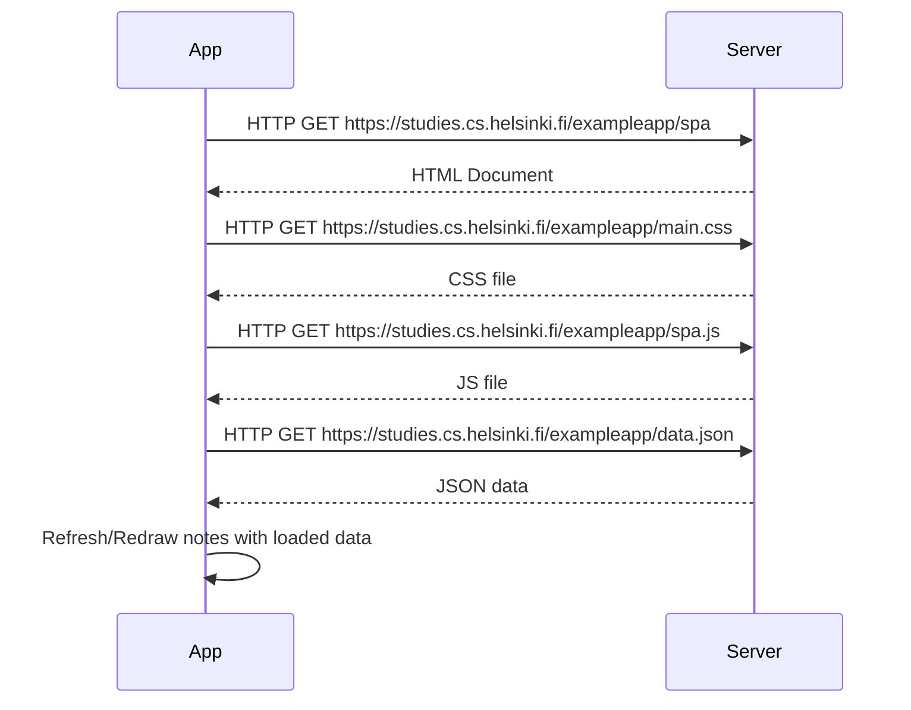

```mermaid
sequenceDiagram
App->>Server: HTTP GET https://studies.cs.helsinki.fi/exampleapp/spa
Server-->>App: HTML Document
App->>Server: HTTP GET https://studies.cs.helsinki.fi/exampleapp/main.css
Server-->>App: CSS file
App->>Server: HTTP GET https://studies.cs.helsinki.fi/exampleapp/spa.js
Server-->>App: JS file
App->>Server: HTTP GET https://studies.cs.helsinki.fi/exampleapp/data.json
Server-->>App: JSON data
App->>App: Refresh/Redraw notes with loaded data
```
