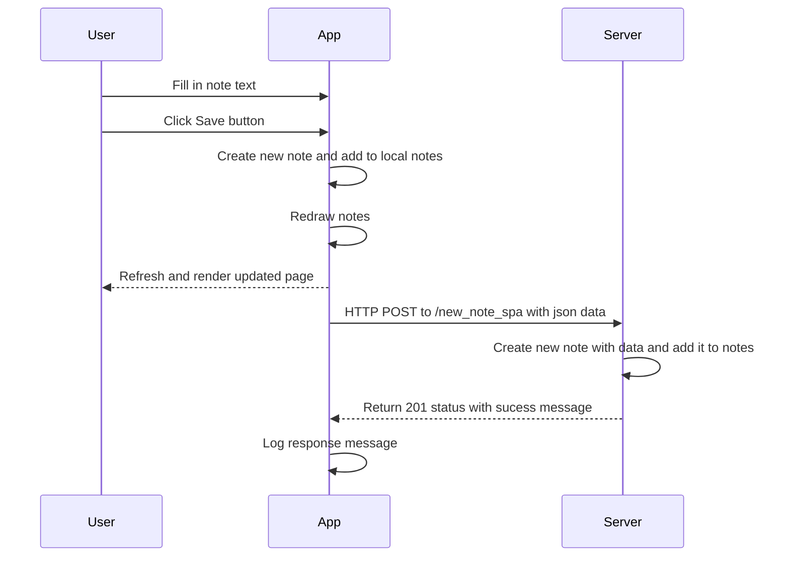

```mermaid
sequenceDiagram
User->>App: Fill in note text
User->>App: Click Save button
App->>App: Create new note and add to local notes
App->>App: Redraw notes
App-->>User: Refresh and render updated page
App->>Server: HTTP POST to /new_note_spa with json data
Server->>Server: Create new note with data and add it to notes
Server-->>App: Return 201 status with sucess message
App->>App: Log response message
```
